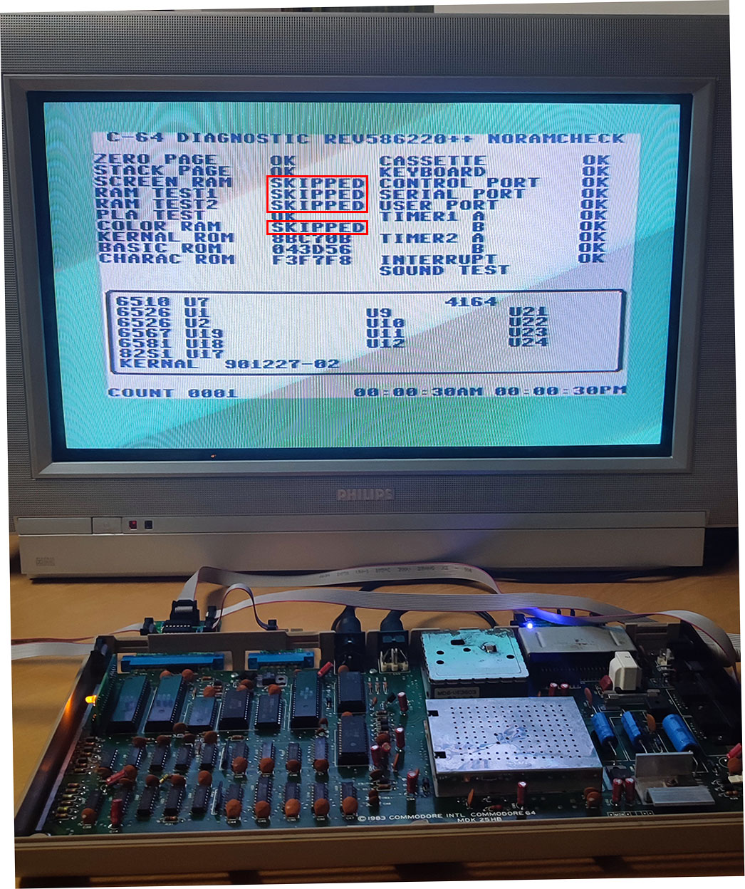

# C64 Diagnostic 586220++ noramcheck

This is a modified version of the 586220++ v0.5 diagnostic cart, which skips all ram checks in order to run through faster.

It is not intended to diagnose defective C64s, but to check a test harness on a good C64. Skipping the RAM check speeds up the whole process significantly.

The source code can be compiled in [C64Studio](https://www.georg-rottensteiner.de/).
